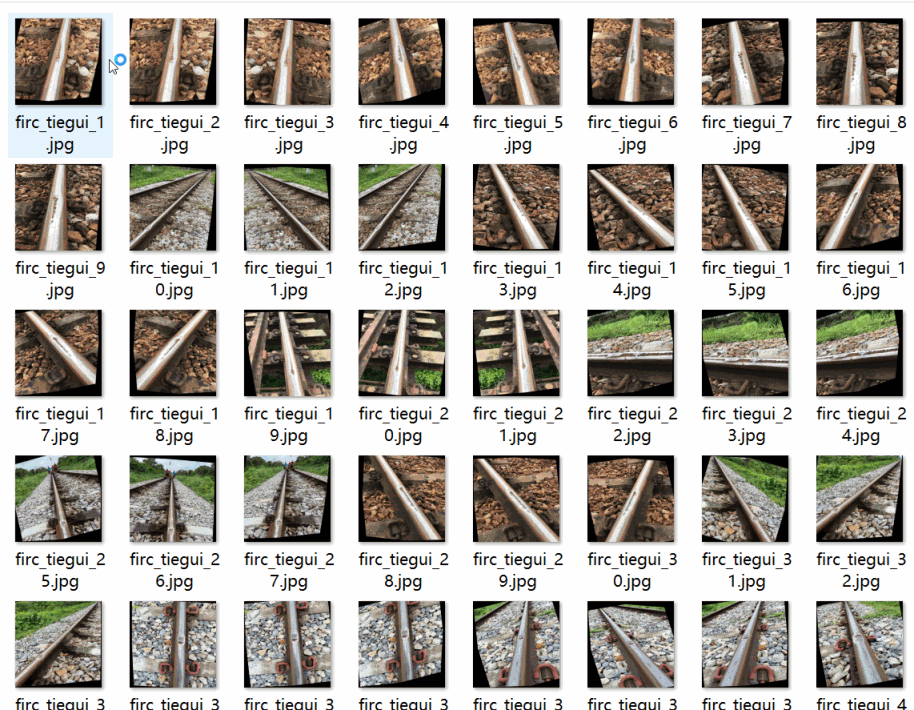
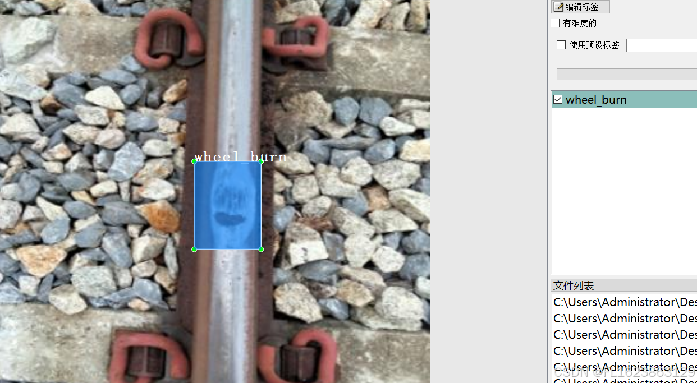

# Railway Track Defect Detection Data Set VOC+YOLO Format with 4020 Images and 4 Categories with Enhancements

Dataset format: Pascal VOC format + YOLO format (txt file without split path, only contains jpg images and corresponding VOC format xml files and YOLO format txt files)
number of images: 4020  
annotation count: 4020  
Number of txt files: 4020
annotationnumber of classes: 4  
annotation class names:["corrugation","spalling","squat","wheel_burn"]  
boxes per class:   
corrugation box count = 1452  
spalling box count = 2208  
squat box count = 2949  
wheel_burn box count = 546  
Total Frames: 7155
Use annotation tool: labelImg
Annotation rules: draw a rectangle around the class for labeling.
Important notes: Approximately three-quarters of the dataset is enhanced, please carefully review and download cautiously.
Special statement: This dataset does not guarantee any accuracy in the training model or weight file.
Overall picture:
```
```
## Images




Here is a pay link on Stripe ( https://buy.stripe.com/3cs8yP7sY87d0vu9AB ). Please contact me lonlonago@foxmail.com after funding $89, and I will send you a complete data files , thank you!

